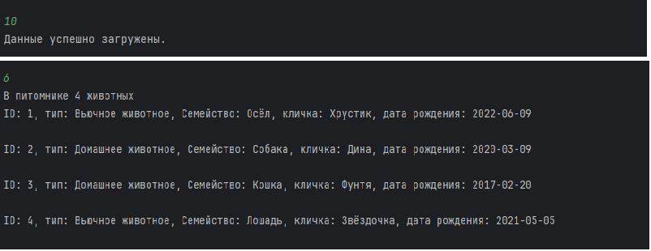
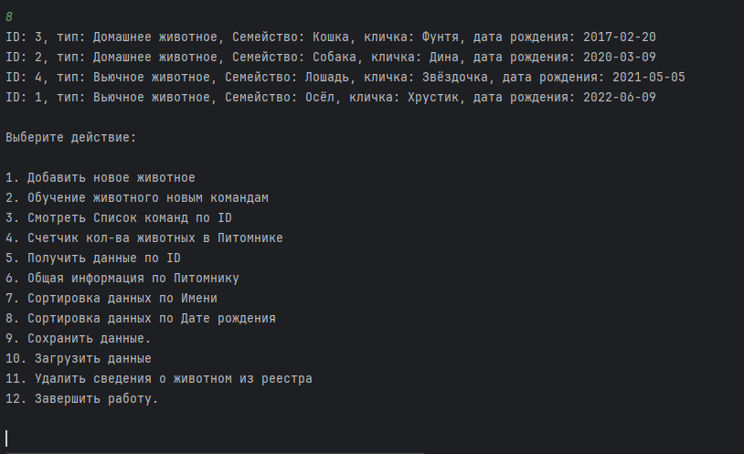

# Питомник для животных

## Информация о проекте: ##
- Необходимо организовать систему учета для питомника в котором живут
домашние и вьючные животные.

### Задачи проекта: ###
1. Используя команду cat в терминале операционной системы Linux, создать
два файла Домашние животные (заполнив файл собаками, кошками,
хомяками) и Вьючные животными заполнив файл Лошадьми, верблюдами и
ослы, а затем объединить их. Просмотреть содержимое созданного файла.
Переименовать файл, дав ему новое имя (Друзья человека).
2. Создать директорию, переместить файл туда.

3. Подключить дополнительный репозиторий MySQL.

4. Установить и удалить deb-пакет с помощью dpkg.

5. Выложить историю команд в терминале ubuntu

6. Нарисовать диаграмму, в которой есть класс родительский класс, домашние
животные и вьючные животные, в составы которых в случае домашних
животных войдут классы: собаки, кошки, хомяки, а в класс вьючные животные
войдут: Лошади, верблюды и ослы.

7. В подключенном MySQL репозитории 

создать базу данных “Друзья
человека”

8. Создать таблицы с иерархией из диаграммы в БД

9. Заполнить низкоуровневые таблицы именами(животных), командами
которые они выполняют и датами рождения

10. Удалив из таблицы верблюдов, т.к. верблюдов решили перевезти в другой
питомник на зимовку. 

Объединить таблицы лошади, и ослы в одну таблицу.

11. Создать новую таблицу “молодые животные” в которую попадут все
животные старше 1 года, но младше 3 лет и в отдельном столбце с точностью
до месяца подсчитать возраст животных в новой таблице

12. Объединить все таблицы в одну, при этом сохраняя поля, указывающие на
    прошлую принадлежность к старым таблицам

13. Создать класс с Инкапсуляцией методов и наследованием по диаграмме.
Класс создан на языке программирования JAVA:
- основной класс: Animal
- родительский класс: HomeAnimal(Домашнее животное) | PackAnimal(Вьючное животное);
- классы-наследники:
- HomeAnimal: Dog(Собака), Cat(Кошка), Hamster(Хомяк);
- PackAnimal: Horse(Лошадь), Camel(Верблюд), Donkey(Осёл).
Данные в приложение:

14. Написана программа, имитирующая работу реестра домашних животных - Animal_House.

Программа выполняет следующие действия (!Пункты указаны в соответствие с № действия в программе!):
1)создать новое животное;

2)обучение животного новым командам;

3)смотреть список команд по ID;

4)содержит счетчик животных в питомнике;

5)даёт возможность получить данные по ID;

6)показывает общий реестр питомника;
произведена загрузка данных из файла (действие №10) (для полноты сведения о данное действии)

7)возможность сортировки данных по имени(кличке);

8)возможность сортировки данных по дате рождения;

9)сохраняет данные в файл;

10)загружает данные из файла;
!Загрузка данных выполнена в действии №10.

11)удаляет сведения о животном из реестра.

12)Программа выполняет безопасное завершение работы.